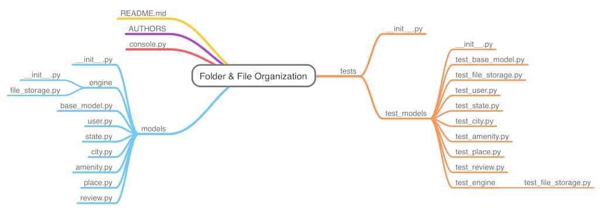
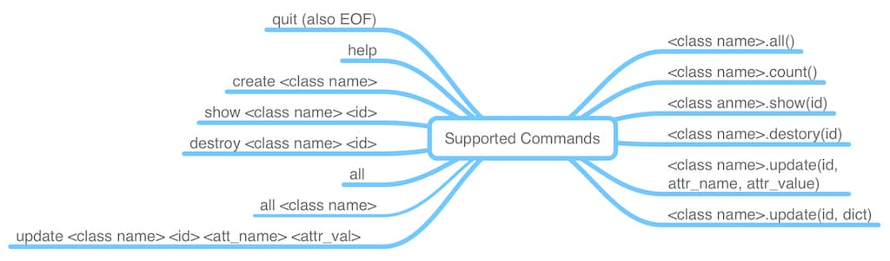

# AirBnB Clone - The Console

[]

## Project Overview

AirBnB Clone (the console) is the first in the serious of projects to wards a full stack AirBnB web application. This repo contains a console application that can be used to manage the various instances of class used in the AirBnB web application.


## Project File Organization

This project is organized as shown in the diagram below. In this hierarchal structure, all the models are stored in the models folder while the tests are stored in the tests folder



## Supported Commands

This console application supports a number of commands. This commands can be run in both interactive and non-interactive modes.



## Usage

### Starting the interpreter

The console interpreter can be used in both interactive and non-interactive modes

#### Interactive Mode

```bash
$ ./console.py
(hbnb) help

Documented commands (type help <topic>):
========================================
EOF  all  count  create  destroy  help  quit  show  update

(hbnb) 
(hbnb) quit
$
```

#### Non-Interactive Mode

```bash
$ echo "help" | ./console.py
(hbnb) 
Documented commands (type help <topic>):
========================================
EOF  all  count  create  destroy  help  quit  show  update

(hbnb)
$
```

### Executing commands

To execute a command you specify it's name and optionally its arguments. Some commands have no arguments while others have multiple. The help command shows the details of all the commands.

#### Examples on Interactive Mode

```bash
$ ./console.py
(hbnb) create BaseModel
d81b20ec-5b06-42d3-aefe-ea3798892a19
(hbnb) all
["[BaseModel] (d81b20ec-5b06-42d3-aefe-ea3798892a19) {'id': 'd81b20ec-5b06-42d3-aefe-ea3798892a19', 'created_at': datetime.datetime(2022, 10, 30, 22, 39, 14, 426961), 'updated_at': datetime.datetime(2022, 10, 30, 22, 39, 14, 426981)}"]
(hbnb) show BaseModel d81b20ec-5b06-42d3-aefe-ea3798892a19
[BaseModel] (d81b20ec-5b06-42d3-aefe-ea3798892a19) {'id': 'd81b20ec-5b06-42d3-aefe-ea3798892a19', 'created_at': datetime.datetime(2022, 10, 30, 22, 39, 14, 426961), 'updated_at': datetime.datetime(2022, 10, 30, 22, 39, 14, 426981)}
(hbnb) quit
$
```

#### Examples on Non-Interactive Mode

```bash
❯ echo "create BaseModel" | ./console.py
(hbnb) 64b15c6c-6693-45fa-87c7-3ad1ae413b13
(hbnb)
$
$ echo "destroy BaseModel 64b15c6c-6693-45fa-87c7-3ad1ae413b13" | ./console.py
(hbnb)
$
```

Project Resource:
[cmd module](https://docs.python.org/3.8/library/cmd.html#cmd.Cmd.precmd)

["A generic class to build line-oriented command interpreters](https://github.com/python/cpython/blob/3.8/Lib/cmd.py)

[cmd module in depth](https://pymotw.com/2/cmd/)

[uuid module](https://docs.python.org/3.8/library/uuid.html)

[date and time](https://docs.python.org/3.8/library/datetime.html)

[calender](https://docs.python.org/3.8/library/calendar.html#module-calendar)

[calender source code](https://github.com/python/cpython/blob/3.8/Lib/calendar.py)

[time](https://docs.python.org/3.8/library/time.html#module-time)

[unittest](https://docs.python.org/3.8/library/unittest.html#module-unittest)

[test py docs](https://www.pythonsheets.com/notes/python-tests.html)

[wiki test py](https://wiki.python.org/moin/CmdModule)

[python unittest](https://realpython.com/python-testing/)

## Authors

1. SAMUEL EFFIONG <samueleffiong685@samueleffiongjacob>
