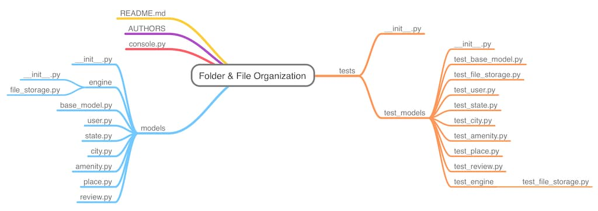
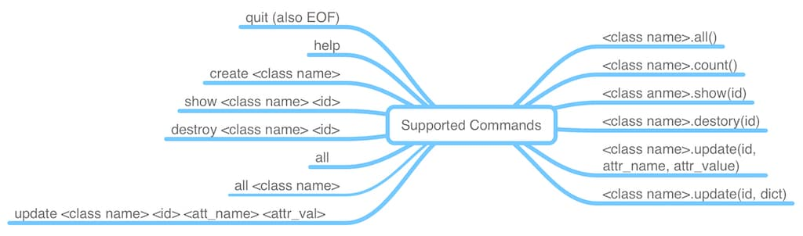

# AirBnB Clone - The Console


## Table of Contents

* [Description](#description)
* [Purpose](#purpose)
* [Requirements](#requirements)
* [Bugs](#bugs)
* [Authors](#authors)
* [License](#license)

## Description


## Purpose

The purpose of this project is to understand how to:

* create a Python package
* create a command interpreter using the `cmd` module
* serialize and deserialize a Class
* write and read a JSON file
* manage `datetime`
* use `*args` and `**kwargs`
* handle named arguments in a function

### HTML and CSS concepts

Now that you have a command interpreter for managing your AirBnB objects, it’s time to make them alive!

Before developing a big and complex web application, we will build the front end step-by-step.

The first step is to “design” / “sketch” / “prototype” each element:

* Create simple HTML static pages
* Style guide
* Fake contents
* No Javascript
* No data loaded from anything

During this project, you will learn how to manipulate HTML and CSS languages. HTML is the structure of your page, it should be the first thing to write. CSS is the styling of your page, the design. I really encourage you to fix your HTML part before starting the styling. Indeed, without any structure, you can’t apply any design.

## Learning Objectives

* What is `HTML`
* How to create an `HTML page`
* What is a `markup language`
* What is the `DOM`
* What is an `element / tag`
* What is an attribute
* How does the browser load a webpage
* What is `CSS`
* How to add style to an element
* What is a `class`
* What is a `selector`
* How to compute `CSS Specificity Value`
* What are `Box properties` in `CSS`

## Requirements

### PYTHON SCRIPT REQUIREMENTS  

* allowed editors: `vi`, `vim`, `emacs`
* the first line of all files should be exactly `#!/usr/bin/python3`
* all code should use the `PEP8` style (version 1.7.*)
* all files must be executable
* all files will be interpreted/compiled on Ubuntu 14.04 LTS using `python3` (version 3.4.3)

### PYTHON TEST CASE REQUIREMENTS

* all test files should be in the folder `tests`
* all test files should be text files (extension: `.txt`)
* all test files should be executed using the command `python3 -m doctest ./tests/*`
* all modules should have documentation `python3 -c 'print(__import__("my_module").__doc__)'`
* all functions (inside and outside of classes) should have documentation `python3 -c 'print(__import__("my_module").my_funct\
ion.__doc__)'`

### General

* Allowed editors: `vi`, `vim`, `emacs`
* All your files should end with a new line
* A `README.md` file, at the root of the folder of the project, is mandatory
* Your code should be `W3C compliant` and validate with `W3C-Validator`
* All your CSS files should be in styles folder
* All your images should be in images folder
* You are not allowed to use `!important` and `id (#... in the CSS file)`
* You are not allowed to use tags `img`, `embed` and `iframe`
* You are not allowed to use `Javascript`
* Current screenshots have been done on Chrome 56 or more.
* No cross browsers
* You have to follow all requirements but some margin/padding are missing - you should try to fit as much as you can to screenshots

## Usage Examples for console

### Interactive Mode

```python3
~/me$ ./console.py
(hbnb) help

Documented commands (type help <topic>):
========================================
EOF  help  quit

(hbnb)
(hbnb)
(hbnb) quit
~/me$
```

### Non-Interactive Mode

```python3
~/me$ echo "help" | ./console.py
(hbnb)

Documented commands (type help <topic>):
========================================
EOF  help  quit
(hbnb)

~/me$ cat test_help
help
~/me$ cat test_help | ./console.py
(hbnb)

Documented commands (type help <topic>):
========================================
EOF  help  quit
(hbnb)
~/me$
```

## Bugs

At this time, there are no known bugs.

## License

**AirBnB Clone** is open source and free to download and use

[]

## Project Overview

AirBnB Clone (the console) is the first in the serious of projects to wards a full stack AirBnB web application. This repo contains a console application that can be used to manage the various instances of class used in the AirBnB web application.


## Project File Organization

This project is organized as shown in the diagram below. In this hierarchal structure, all the models are stored in the models folder while the tests are stored in the tests folder



### Supported Commands

This console application supports a number of commands. This commands can be run in both interactive and non-interactive modes.



## Usage

### Starting the interpreter

The console interpreter can be used in both interactive and non-interactive modes

### Executing commands

To execute a command you specify it's name and optionally its arguments. Some commands have no arguments while others have multiple. The help command shows the details of all the commands.

#### Examples on Interactive Mode

```bash
$ ./console.py
(hbnb) create BaseModel
d81b20ec-5b06-42d3-aefe-ea3798892a19
(hbnb) all
["[BaseModel] (d81b20ec-5b06-42d3-aefe-ea3798892a19) {'id': 'd81b20ec-5b06-42d3-aefe-ea3798892a19', 'created_at': datetime.datetime(2022, 10, 30, 22, 39, 14, 426961), 'updated_at': datetime.datetime(2022, 10, 30, 22, 39, 14, 426981)}"]
(hbnb) show BaseModel d81b20ec-5b06-42d3-aefe-ea3798892a19
[BaseModel] (d81b20ec-5b06-42d3-aefe-ea3798892a19) {'id': 'd81b20ec-5b06-42d3-aefe-ea3798892a19', 'created_at': datetime.datetime(2022, 10, 30, 22, 39, 14, 426961), 'updated_at': datetime.datetime(2022, 10, 30, 22, 39, 14, 426981)}
(hbnb) quit
$
```

#### Examples on Non-Interactive Mode

```bash
❯ echo "create BaseModel" | ./console.py
(hbnb) 64b15c6c-6693-45fa-87c7-3ad1ae413b13
(hbnb)
$
$ echo "destroy BaseModel 64b15c6c-6693-45fa-87c7-3ad1ae413b13" | ./console.py
(hbnb)
$
```

Project Resource:
[cmd module](https://docs.python.org/3.8/library/cmd.html#cmd.Cmd.precmd)

["A generic class to build line-oriented command interpreters](https://github.com/python/cpython/blob/3.8/Lib/cmd.py)

[cmd module in depth](https://pymotw.com/2/cmd/)

[uuid module](https://docs.python.org/3.8/library/uuid.html)

[date and time](https://docs.python.org/3.8/library/datetime.html)

[calender](https://docs.python.org/3.8/library/calendar.html#module-calendar)

[calender source code](https://github.com/python/cpython/blob/3.8/Lib/calendar.py)

[time](https://docs.python.org/3.8/library/time.html#module-time)

[unittest](https://docs.python.org/3.8/library/unittest.html#module-unittest)

[test py docs](https://www.pythonsheets.com/notes/python-tests.html)

[wiki test py](https://wiki.python.org/moin/CmdModule)

[python unittest](https://realpython.com/python-testing/)

## Authors

1. SAMUEL EFFIONG <samueleffiong685@samueleffiongjacob>
